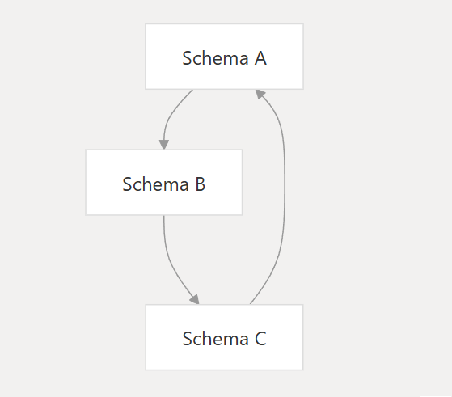

# Qubership APIHUB: API Visitor
## Overview
API Visitor is designed for secure and structured processing of Open API specifications using the `Visitor` pattern. It provides type-safe traversal of complex API schemes, including detecting self-references and preventing infinite recursion.

## Features
- **Type-safe traversal:** The module provides mechanisms for safe traversal and transformation of OpenAPI documents with full TypeScript support.
- **Self-link processing:** Detects and marks self-links in schemas using the unique isSelfLoop symbol, preventing endless recursion.
- **Visitor Pattern:** Uses the visitor pattern to bypass and transform API specification elements, making it easier to analyze and modify the API structure.
- **Multiple distribution** formats: Supports CommonJS, ES modules, and integration with TypeScript projects, providing flexibility in use.

## Self loops

API Visitor automatically identifies and marks self-references in schemas using a robust mechanism to detect and handle self-referential loops during schema traversal - the unique `isSelfLoop` symbol.
This avoids endless recursion when traversing and processing self-referencing specifications, which is especially important when analyzing complex and interconnected APIs.

### Prevents
- **Recursive structures:** Data structures that contain instances of themselves
- **Bidirectional relationships:** Schemas that reference each other
- **Parent-child hierarchies:** Parent contains children of same type

### isSelfLoop
When a self-link is detected, the system adds a special isSelfLoop symbol to the schema object. 

This marker:
- It does not affect the contents of the schema.
- It is easily recognized in the code that uses the user's output.
- Allows stable determination of cycle points.

The symbol is added only at the loop detection location, not to all schema instances.
API clients can check for an isSelfLoop to decide whether to continue traversing the branch.
This prevents infinite recursion when processing cyclic structures of the Open API, leaving freedom in choosing a processing strategy.